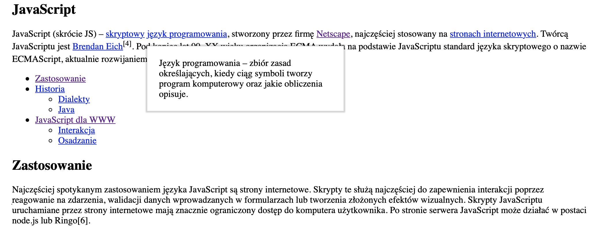
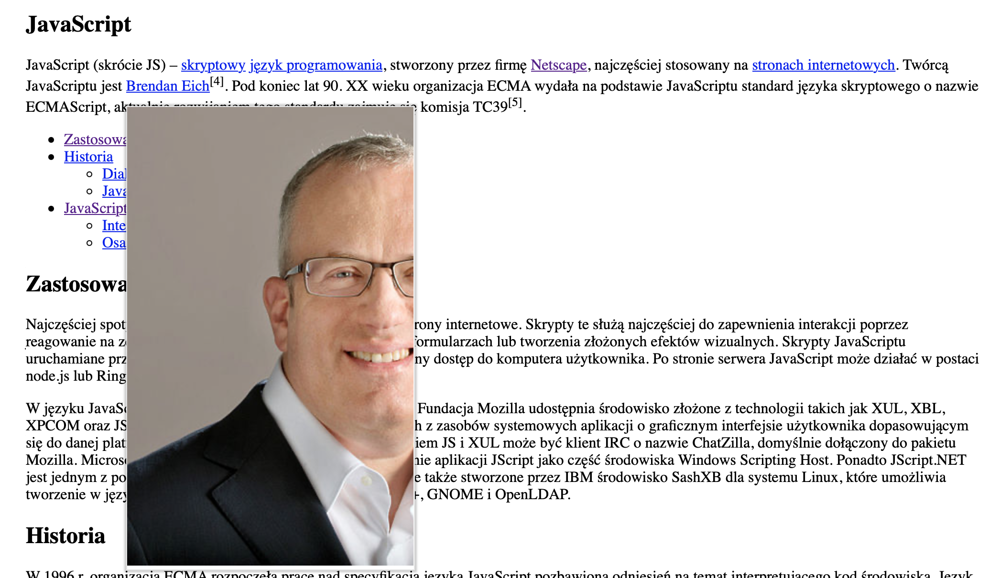

# JavaScript DOM Elements Project

My second project in JavaScript. Using existing code, I had to add two functionality like:

1. Tooltip - there are two type of tooltip, text and image
2. Table of content - based on an array of object

I couldn't modify HTML code.
I added solutions only in JS file.

## How to use it
Please visit the website below to see the result of this project

## Technologies:
* JavaScript
* HTML
* CSS

## Links
* Live Site URL: [E.Kopacz JS DOM Elements Project](https://ekopacz-js-dom-project.netlify.app)

## Solutions
Creating this project I had an opportunity to practice:
* creating and adding new elements in HTML with appropriate attributes using only JS,
* creating function for repetitive elements like:
    * function to create: a, span, ul, li tags and function to change innerText.
* creating and using if…else Statements in JS,
* using: forEach() and filter() methods,
* using objects in array.

### Feel free to contact me:
* [Linkedin](https://www.linkedin.com/in/ewelina-kopacz-929559100/) - Ewelina Kopacz

### Project preview

Tooltip as text

Tooltip as image

### Thanks for project and support to Mateusz Bogolubow:
* Mentor i Trener Programowania JavaScript - [DevMentor](https://devmentor.pl/) - Mateusz Bogolubow
